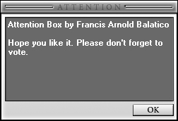

<div align="center">

## \_Attention Box\_


</div>

### Description

A custom message box that is both simple and easy to make. Just read the included ReadMe file. Please don't forget to vote. Thanks and God Bless.
 
### More Info
 


<span>             |<span>
---                |---
**Submitted On**   |2004-06-09 22:11:34
**By**             |[Francis Arnold G\. Balatico](https://github.com/Planet-Source-Code/PSCIndex/blob/master/ByAuthor/francis-arnold-g-balatico.md)
**Level**          |Intermediate
**User Rating**    |4.7 (56 globes from 12 users)
**Compatibility**  |VB 6\.0
**Category**       |[Custom Controls/ Forms/  Menus](https://github.com/Planet-Source-Code/PSCIndex/blob/master/ByCategory/custom-controls-forms-menus__1-4.md)
**World**          |[Visual Basic](https://github.com/Planet-Source-Code/PSCIndex/blob/master/ByWorld/visual-basic.md)
**Archive File**   |[\_Attention175560692004\.zip](https://github.com/Planet-Source-Code/francis-arnold-g-balatico-attention-box__1-54288/archive/master.zip)

### API Declarations

```
Private Declare Function Sendmessageaslong Lib "user32" _
  Alias "SendMessageA" (ByVal hWnd As Long, ByVal wMsg As Long, _
    ByVal wParam As Long, ByVal lParam As Long) As Long
Private Const EM_GETLINECOUNT = 186
Private Declare Sub ReleaseCapture Lib "user32" ()
Private Declare Function SendMessage Lib "user32" Alias "SendMessageA" (ByVal hWnd As Long, ByVal wMsg As Long, ByVal wParam As Integer, ByVal lParam As Long) As Long
```


